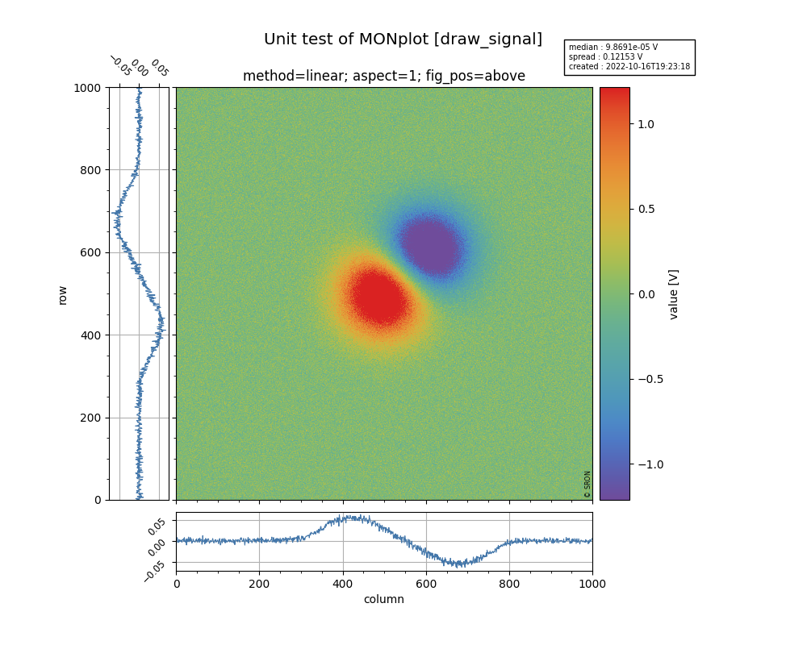
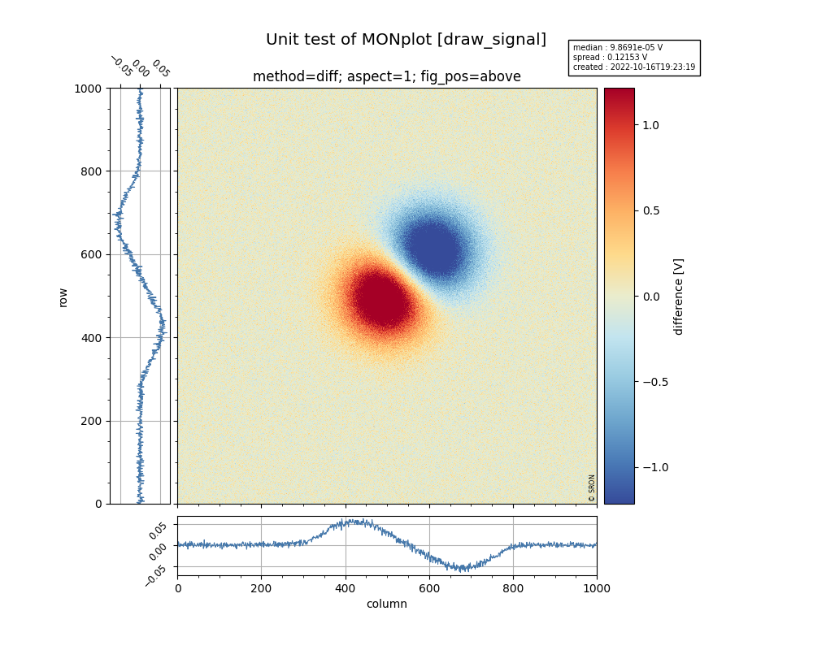

.. _quick:

Quick Start Guide
=================

Install
-------

If there are wheels for your platform (mac, linux, windows on x86),
you can install ``moniplot`` via pip::

  pip install [--user] moniplot

Or with `Anaconda <http://continuum.io/downloads>`_ or
`Miniconda <http://conda.pydata.org/miniconda.html>`_::

  conda install moniplot

To install `moniplot` from source see :ref:`install`.

Core concepts
-------------

When you perform calibration data analysis or instrument monitoring, you may
want to visualize the data, compare it with earlier results, look for trends
in your data and correlate these with changes in instrument settings. Or when
your instrument is in the space, you may want to geolocate your measurements.
Ths class :py:class:`MONplot` allows you to generate these figures and you can
choose to combine them in one PDF report.

Each figure generated with :py:class:`MONplot` has a `caption` to structure
your report, a `title` which describes the data, and a small info-box where
you can put essential information on the date you generate this figure
(automatically added) and for example timestap of your measurement,
version of software and/or data, etc.

Nearly all methods of :py:class:`MONplot` accept your data as a
:py:class:`numpy.ndarray` or a :py:class:`xarray.DataArray`.
The attributes and coordinates of the :py:class:`xarray.DataArray` are used as
names for the axis in the figure and the attributes `long_name` and `units` is
used in the data labels. 

Let's assume that you have your data of your 2-D detector stored in a
:py:class:`xarray.DataArray` `xda` with coordinates `column` and `row`.
The very first thing you'll need to do is to initialize a report::

  >>> from moniplot.mon_plot import MONplot
  >>> plot = MONplot('my_first_report.pdf', caption='<name of my instrument>')

Now you can start adding figures to the report `plot`::

  >>> plot.draw_signal(xds, title='Raw detector signal')

This will generate a central image (generated with matplotlib.imshow),
a panel on the left with the row-medians, a panel below the central image with
the column-medians and a colorbar on the right of the central image.
The axis will have the labels of the coordinates and the units of the data are
shown in the label of the colorbar. The info-box contains the median and
standard deviation of the image data and the creation time the figure.

For some measurements it might be interessting to show an histogram of your
image data (dark or noise measurements)::

  >>> plot.draw_hist(xds)

Assume that you want to compare this measurement with another `xds2`.
Note that if only the data of the DataArray is different then you dan
subtract both, otherwise you will have subtract it as an numpy array:
xdr - xdr2.values. Let's add another figure to the report::

   >>> plot.draw_signal(xds - xds2, title='Raw detector signal', zscale='diff')

A diverging colormap is used when zscale equals 'diff' or 'ratio'.

Now we can finalize the report, which will generate the file
'my_first_report.pdf'::

  >>> plot.close()
